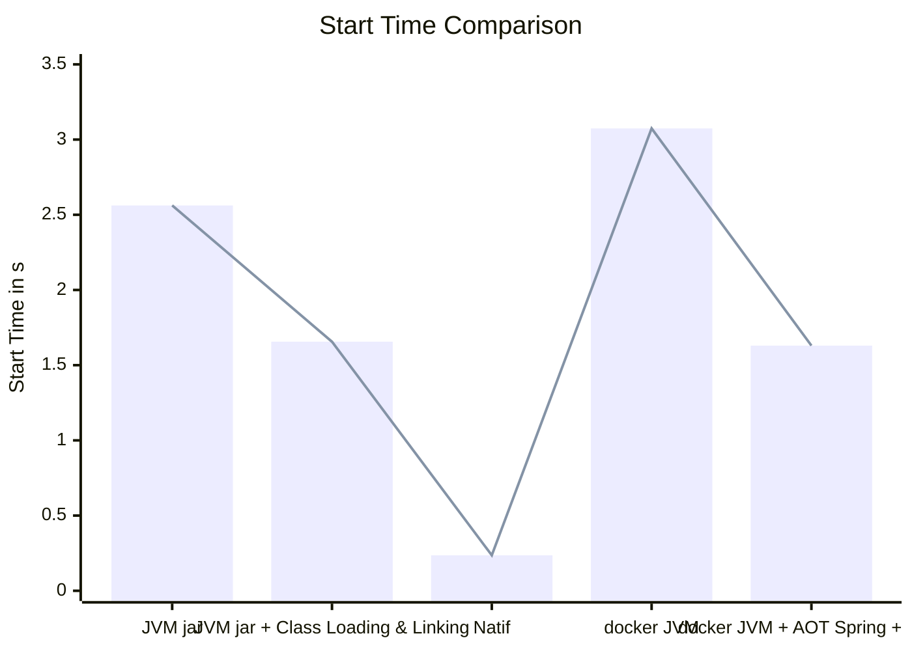

# Optimisation avec JDK >= 24 (Ahead-of-Time Class Loading & Linking)

### Application Springboot REST + DB (MySQL ou H2) + Properties + Timer

Comparer les temps de startup selon les différentes configurations

- build + run en mode JVM dev spring-boot:run
- build + run en mode JVM avec un fat jar
- build + run en mode JVM avec un fat jar + Class Loading & Linking (feature jdk >= 24) [JEP 514](https://openjdk.org/jeps/514)
- build + run en mode container docker JVM avec buildpack
- build + run en mode container docker JVM + AOT Spring + CDS avec buildpack
- build + run en mode container docker JVM + AOT Spring + AOT Class Loading & Linking (Leyden)
- build + run en mode natif avec GraalVM (necessite GraalVM installé)
- build + run en mode container docker natif buildpack

---

📌 Tableau récapitulatif des temps de démarrage

| Configuration                                         | Start Time                        | Taille du livrable |
|-------------------------------------------------------|-----------------------------------|--------------------|
| JVM dev spring-boot:run                               | Started in 1.848 seconds          | NA                 |
| JVM avec un fat jar                                   | Started in 2.562 seconds          |                    |
| JVM avec un fat jar + AOT Class Loading & Linking     | Started in 1.656 seconds          |                    |
| docker JVM avec buildpack                             | 🐢 Started in 3.074 seconds       |                    |
| docker JVM + AOT Spring + CDS avec buildpack          | Started in 1.63 seconds           |                    |
| docker JVM + AOT Spring + AOT Class Loading & Linking | ?                                 |                    |
| natif avec GraalVM                                    | 🏃‍♂️‍➡️ Started in 0.236 seconds | 185 Mo             |
| docker natif avec buildpack                           | Started in 0.554 seconds          |                    |




---

Utilisation du profile h2 : __-Dspring.profiles.active=h2__

Utiliser cette url pour acceder à MySql depuis le container :

```properties
spring.datasource.url=jdbc:mysql://host.docker.internal:3306/person
```
---

## Application Springboot en mode JVM dev

- Build de l'application
    ```shell
    mvn clean package
    ```

- Run de l'application
    ```shell
    mvn -Dspring.profiles.active=h2 spring-boot:run
    ```

## Application Springboot en mode JVM avec un fat jar

- Build de l'application
    ```shell
    mvn clean package
    ```

- Run de l'application
    ```shell
    java -Dspring.profiles.active=h2 -jar target/person-app-1.0.0-SNAPSHOT.jar
    ```

## Application Springboot en mode JVM avec un fat jar + Class Loading & Linking (feature jdk >= 24)

- Build de l'application
    ```shell
    mvn clean package
    ```

- Preparation du fichier de configuration AOT `person.aotconf`

  1️⃣ Démarrer l'app en mode __training__ pour construire le cache AOT
  
  ```shell
  java -XX:AOTMode=record -XX:AOTConfiguration=person.aotconf -Dspring.profiles.active=h2 -jar target/person-app-1.0.0-SNAPSHOT.jar
  ```
  
  2️⃣ Création du fichier de cache `person.aot`
  ```shell
  java -XX:AOTMode=create -XX:AOTConfiguration=person.aotconf -XX:AOTCache=person.aot -cp target/person-app-1.0.0-SNAPSHOT.jar
  ```

- Run de l'application
  ```shell
  java -XX:AOTCache=person.aot -Dspring.profiles.active=h2 -jar target/person-app-1.0.0-SNAPSHOT.jar
  ```
## Avec java 25 [JEP 514](https://openjdk.org/jeps/514), [JEP 515](https://openjdk.org/jeps/515), [JEP 519](https://openjdk.org/jeps/519), [JEP 521](https://openjdk.org/jeps/521)

### JEP 514 : Ahead-of-Time Class Loading & Linking
Le `AOTMode=record` et `AOTMode=create` peuvent être combinés en une seule commande : `AOTCacheOutput`

  1️⃣ Création du fichier de cache `person.aot`
  ```shell
    java -XX:AOTCacheOutput=person.aotconf -Dspring.context.exit=onRefresh -cp target/person-app-1.0.0-SNAPSHOT.jar
  ```

  - Run de l'application
    ```shell
    java -XX:AOTCache=person.aot -Dspring.profiles.active=h2 -jar target/person-app-1.0.0-SNAPSHOT.jar
    ```

### JEP 515 : Ahead-of-Time Method Profiling
Cette fonctionnalité vient par défaut avec le java 25. Il n'y a pas de paramètre spécifique à ajouter.

### JEP 519 : Compact Object Headers

- Run de l'application
  ```shell
  java -XX:+UseCompactObjectHeaders -XX:AOTCache=person.aot -Dspring.profiles.active=h2 -jar target/person-app-1.0.0-SNAPSHOT.jar
  ```

### JEP 521: Generational Shenandoah

Utiliser un openjdk 25 (Liberica par exemple)

- Run de l'application
  ```shell
  java -XX:+UseShenandoahGC -XX:ShenandoahGCMode=generational  -XX:AOTCache=person.aot -Dspring.profiles.active=h2 -jar target/person-app-1.0.0-SNAPSHOT.jar
  ```

## Application Springboot en mode container docker JVM avec buildpack

- Dans la configuration du spring-boot-maven-plugin, ajouter les options suivantes
  - 
```xml
    <configuration>
        <image>
            <env>
              <BP_JVM_VERSION>21</BP_JVM_VERSION>
              <BPE_DELIM_JAVA_TOOL_OPTIONS xml:space="preserve"> </BPE_DELIM_JAVA_TOOL_OPTIONS>
              <BPE_APPEND_JAVA_TOOL_OPTIONS>-Dspring.profiles.active=h2</BPE_APPEND_JAVA_TOOL_OPTIONS>
            </env>
          <name>${project.artifactId}-jvm:${project.version}</name>
        </image>
    </configuration>
```

Commande permettant de construire l'image docker __JVM__ avec le plugin __spring-boot-maven-plugin__. Ce plugin utilise
buildpacks pour construire l'image.

- Build de l'application
  ```shell
  mvn clean -Dimage.suffix=jvm spring-boot:build-image
  ```

- Run de l'application
  ```shell
  docker run -i --rm -p 8080:8080 docker.io/library/person-app-jvm:1.0.0-SNAPSHOT
  ```

## Application Springboot en mode container docker JVM avec buildpack + CDS + AOT avec buildpack

Dans la configuration du spring-boot-maven-plugin, ajouter les options suivantes:

```xml
    <configuration>
        <image>
            <env>
                <BP_SPRING_AOT_ENABLED>true</BP_SPRING_AOT_ENABLED>
                <BP_JVM_CDS_ENABLED>true</BP_JVM_CDS_ENABLED>
            </env>
        </image>
    </configuration>
    <executions>
        <execution>
            <goals>
                <goal>process-aot</goal>
            </goals>
        </execution>
    </executions>
```

- Build de l'application
  ```shell
  mvn clean -Dimage.suffix=jvm spring-boot:build-image
  ```

- Run de l'application
  ```shell
  docker run -i --rm -p 8080:8080 docker.io/library/person-app-jvm:1.0.0-SNAPSHOT
  ```

## Application Springboot en mode container docker JVM AOT Spring + CDS ou AOT Spring +  AOT Class Loading & Linking

La génération du fichier AOT Cache (Projet Leyden) n'est pas possible actuellement avec buildpack. Nous utilisons un packaging classique avec Dockerfile.

Rappels :
- `CDS` (Class Data Sharing) : permet de pré-charger et partager des classes dans une archive (__.jsa__).
  - On l'utilise avec l'option `-XX:SharedArchiveFile=`
  - Le `spring-boot-maven-plugin` avec l'option `BP_SPRING_CDS_ENABLED` produit une image docker avec cette optimisation
- `AOT Spring` : Il est géré par spring lui-même via le goal `spring-boot:process-aot`
  - Cela produit du bytecode spécifique ajouté au jar applicatif. La JVM ne voit que les classes du jar file
  - Le `spring-boot-maven-plugin` avec l'option `BP_JVM_AOT_ENABLED`  produit une image docker avec cette optimisation
- `JVM AOT Cache` : Génère du code natif et fabrique un cache pour accélérer les démarrages
  - On l'utilise avec l'option `-XX:AOTCache=`

✅ La cohabitation entre `-XX:SharedArchiveFile=` et `-XX:AOTCache=` n'est pas possible mais il faut savoir que :
  - Pour un jdk < 24 l'utilisation de __CDS__ est intéressante  
  - Pour un jdk >= 24 il est préférable d'utiliser __AOTCache__

### Mise en oeuvre à l'aide d'un container docker :

1️⃣ `AOT Spring` : Activer l'execution du `process-aot` dans le `spring-boot-maven-plugin` du pom.xml

```xml
    <executions>
        <execution>
            <goals>
                <goal>process-aot</goal>
            </goals>
        </execution>
    </executions>
```
Build de l'application :
```shell
  mvn clean package
```

Le jar applicatif contient maintenant le cache AOT Spring

2️⃣ `CDS` : Utilisation de `java -XX:ArchiveClassesAtExit=application.jsa`

Docker file utilisé pour activer CDS sur l'application :

```dockerfile
  FROM bellsoft/liberica-openjre-debian:25-cds
  WORKDIR /application
  ARG JAR_FILE=target/*.jar
  # Copy the jar file to the working directory and rename it to application.jar
  COPY ${JAR_FILE} application.jar
  # Execute the CDS training run
  RUN java -XX:ArchiveClassesAtExit=application.jsa -Dspring.context.exit=onRefresh -Dspring.profiles.active=h2 -jar application.jar
  # Start the application jar with CDS and AOT Spring
  ENTRYPOINT ["java", "-XX:SharedArchiveFile=application.jsa", "-Dspring.profiles.active=h2", "-jar", "application.jar"]
```

Packaging de l'application dans une image docker :
  ```shell
    docker build -f src/main/docker/Dockerfile.jvm_cds -t springboot-person-app-jvm-cds:person-app-1.0.0-SNAPSHOT .
  ```

Run de l'application
  ```shell
    docker run -i --rm -p 8080:8080 springboot-person-app-jvm-cds:person-app-1.0.0-SNAPSHOT
  ```

3️⃣ `JVM AOT Cache` :

Ajouter dans le Dockerfile les instructions permettant la création du cache AOT

```dockerfile
  FROM bellsoft/liberica-openjre-debian:25-cds
  WORKDIR /application
  ARG JAR_FILE=target/*.jar
  # Copy the jar file to the working directory and rename it to application.jar
  COPY ${JAR_FILE} application.jar
  # Execute the AOT cache training run
  RUN java -XX:AOTMode=record -XX:AOTConfiguration=app.aotconf -Dspring.context.exit=onRefresh -jar application.jar
  RUN java -XX:AOTMode=create -XX:AOTConfiguration=app.aotconf -XX:AOTCache=app.aot -jar application.jar && rm app.aotconf
  # Start the application jar AOT Spring and AOT Cache
  ENTRYPOINT ["java", "-XX:AOTCache=app.aot", "-jar", "application.jar"]
```

Packaging de l'application dans une image docker :
  ```shell
    docker build -f src/main/docker/Dockerfile.jvm_aotcache -t springboot-person-app-jvm-aotcache:person-app-1.0.0-SNAPSHOT .
  ```

Run de l'application
  ```shell
    docker run -i --rm -p 8080:8080 springboot-person-app-jvm-aotcache:person-app-1.0.0-SNAPSHOT
  ```

## Application Springboot en mode natif avec GraalVM (necessite GraalVM installé)

Il faut préalablement avoir installé GraalVM et le support natif pour Java. Pour cela, le plugin __native-maven-plugin__ est utilisé.

- Vérification avant le build :

  ```shell
  mvn -version
  ```

  ```log
  Apache Maven 3.9.6 (bc0240f3c744dd6b6ec2920b3cd08dcc295161ae)
  Maven home: /Users/fredericmencier/Projects/apache-maven-3.9.6
  Java version: 21.0.8, vendor: Oracle Corporation, runtime: /Users/fredericmencier/.sdkman/candidates/java/21.0.8-graal
  Default locale: fr_FR, platform encoding: UTF-8
  OS name: "mac os x", version: "14.4.1", arch: "aarch64", family: "mac"
  ```

- Build de l'application
  ```shell
  mvn clean native:compile -Pnative
  ```
- Run de l'application
  ```shell
  ./target/person-app
  ```

## Application Springboot en mode container docker natif avec buildpack

Commande permettant de construire l'image docker __NATIVE__ avec le plugin __native-maven-plugin__. Ce plugin utilise buildpacks pour construire l'image.

- Build de l'application
  ```shell
  mvn -Dimage.suffix=native spring-boot:build-image -Pnative
  ```

- Run de l'application
  ```shell
  docker run -i --rm -p 8080:8080 docker.io/library/person-app-native:1.0.0-SNAPSHOT
  ```