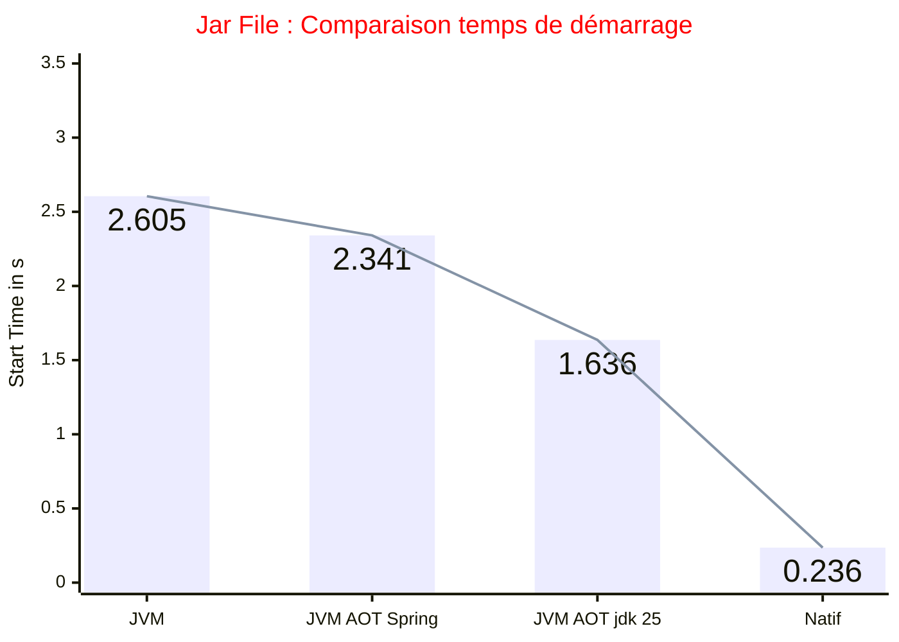
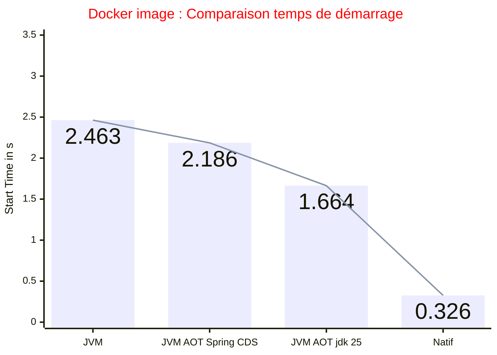

# Optimisation avec JDK >= 24 (Ahead-of-Time Class Loading & Linking)

### Application Springboot REST + DB (MySQL ou H2) + Properties + Timer

Comparaison des temps de startup selon les différentes configurations.
Les tests ont été réalisé avec la configuration suivante sauf lors de l'utilisation des optimisations aot spécifique au jdk25
```log
Apache Maven 3.9.6 (bc0240f3c744dd6b6ec2920b3cd08dcc295161ae)
Maven home: /Users/fredericmencier/Projects/apache-maven-3.9.6
Java version: 21.0.4, vendor: Oracle Corporation, runtime: /Users/fredericmencier/.sdkman/candidates/java/21.0.4-oracle
Default locale: fr_FR, platform encoding: UTF-8
OS name: "mac os x", version: "26.0.1", arch: "aarch64", family: "mac"
```

- [Application Springboot en mode JVM dev](Application Springboot en mode JVM dev)
- [Application Springboot en mode JVM avec un fat jar](#Application Springboot en mode JVM avec un fat jar)
- [Application Springboot en mode JVM avec un fat jar + AOT Spring](#Application Springboot en mode JVM avec un fat jar AOT Spring)
- [Application Springboot en mode JVM avec un fat jar + Class Loading & Linking (jdk 25)](#Application Springboot en mode JVM avec un fat jar Class Loading Linking (jdk 25)) - [JEP 514](https://openjdk.org/jeps/514)
- [Application Springboot en mode container docker JVM avec buildpack](#Application Springboot en mode container docker JVM avec buildpack)
- [Application Springboot en mode container docker JVM + CDS + AOT Spring avec buildpack](#Application Springboot en mode container docker JVM CDS AOT Spring avec buildpack)
- [Application Springboot en mode container docker JVM + AOT Class Loading & Linking (jdk 25)](#Application Springboot en mode container docker JVM AOT Class Loading Linking (jdk 25))
- [Application Springboot en mode natif avec GraalVM (necessite GraalVM installé)](#Application Springboot en mode natif avec GraalVM (necessite GraalVM installé))
- [Application Springboot en mode container docker natif avec buildpack](Application Springboot en mode container docker natif avec buildpack)

---

📌 Tableau récapitulatif des temps de démarrage

| Configuration                                              | Start Time                       | Taille du livrable |
|------------------------------------------------------------|----------------------------------|--------------------|
| JVM dev                                                    | Started in 1.911 seconds         | NA                 |
| JVM avec un fat jar                                        | Started in 2.605 seconds     🐢  | 61.3 Mo            |
| JVM avec un fat jar + AOT Spring                           | Started in 2.341 seconds         | 61.6 Mo            |
| JVM avec un fat jar + AOT Class Loading & Linking (jdk 25) | Started in 1.636 seconds         | 61.3 Mo            |
| __Docker__ JVM avec buildpack                              | Started in 2.463 seconds         | 259.22 Mo          |
| __Docker__ JVM + AOT Spring + CDS avec buildpack           | Started in 2.186 seconds         | 321.7 Mo           |
| __Docker__ JVM + AOT Class Loading & Linking (jdk 25)      | Started in 1.664 seconds         | 543.77 Mo          |
| Natif avec GraalVM                                         | Started in 0.175 seconds 🏃‍♂️‍➡ | 185 Mo             |
| __Docker__ natif avec buildpack                            | Started in 0.326 seconds         | 222.65 Mo          |





---
 
Utilisation du profile h2 : __-Dspring.profiles.active=h2__

Utiliser cette url pour acceder à MySql depuis le container :

```properties
spring.datasource.url=jdbc:mysql://host.docker.internal:3306/person
```
---

## Application Springboot en mode JVM dev
Pour réaliser ce test on utilise le profile maven `sb_classic`

- Build de l'application
    ```shell
    mvn -Psb_classic clean package -DskipTests
    ```

- Run de l'application
    ```shell
    mvn -Psb_classic spring-boot:run
    ```

## Application Springboot en mode JVM avec un fat jar

- Build de l'application
    ```shell
    mvn -Psb_classic clean package -DskipTests
    ```

- Run de l'application
    ```shell
    java -Dspring.profiles.active=h2 -jar target/person-app-1.0.0-SNAPSHOT.jar
    ```

## Application Springboot en mode JVM avec un fat jar + AOT Spring
Pour réaliser ce test on utilise le profile maven `sb_classic_aotspring`

Pour utiliser l'AOT Spring, il faut activer l'execution du `process-aot` dans le `spring-boot-maven-plugin` du pom.xml

```xml
    <executions>
        <execution>
            <goals>
                <goal>process-aot</goal>
            </goals>
        </execution>
    </executions>
```
- Build de l'application :
  ```shell
    mvn -Psb_classic_aotspring clean package -DskipTests
  ```

- Le jar applicatif contient maintenant le cache AOT Spring. Pour démarrer l'application springboot en mode AOT il faut activer la properties `-Dspring.aot.enabled=true`
  ```shell
    java -Dspring.aot.enabled=true -Dspring.profiles.active=h2 -jar target/person-app-1.0.0-SNAPSHOT.jar
  ```

## Application Springboot en mode JVM avec un fat jar + Class Loading & Linking (jdk 25)
### Avec java 25 [JEP 514](https://openjdk.org/jeps/514), [JEP 515](https://openjdk.org/jeps/515), [JEP 519](https://openjdk.org/jeps/519), [JEP 521](https://openjdk.org/jeps/521)

- Vérification de la configuration :

  ```shell
    mvn -version
  ```

```log
Apache Maven 3.9.6 (bc0240f3c744dd6b6ec2920b3cd08dcc295161ae)
Maven home: /Users/fredericmencier/Projects/apache-maven-3.9.6
Java version: 25, vendor: BellSoft, runtime: /Users/fredericmencier/.sdkman/candidates/java/25-librca
Default locale: fr_FR, platform encoding: UTF-8
OS name: "mac os x", version: "26.0.1", arch: "aarch64", family: "mac"
```

- Build de l'application
  ```shell
    mvn -Psb_classic clean package -DskipTests
  ```
  
### JEP 514 : Ahead-of-Time Class Loading & Linking
Le `AOTMode=record` et `AOTMode=create` peuvent être combinés en une seule commande : `AOTCacheOutput`

-> Création du fichier de cache `person.aot`

- Démarrage de l'application en mode training afin de créer le fichier `person.aot`
  ```shell
    java -XX:AOTCacheOutput=target/person.aot -Dspring.context.exit=onRefresh -Dspring.profiles.active=h2 -jar target/person-app-1.0.0-SNAPSHOT.jar
  ```

- Run de l'application en utilisant le fichier `person.aot`
  ```shell
    java -XX:AOTCache=target/person.aot -Dspring.profiles.active=h2 -jar target/person-app-1.0.0-SNAPSHOT.jar
  ```

### JEP 515 : Ahead-of-Time Method Profiling
Cette fonctionnalité vient par défaut avec le java 25. Il n'y a pas de paramètre spécifique à ajouter.

### JEP 519 : Compact Object Headers
Pour pouvoir utiliser le cache aot avec CompactObjectHeaders il faut avoir buildé le cache aot avec la directive `-XX:+UseCompactObjectHeaders`

- Build du cache avec CompactObjectHeaders
  ```shell
  java -XX:+UseCompactObjectHeaders -XX:AOTCacheOutput=target/person.aot -Dspring.context.exit=onRefresh -Dspring.profiles.active=h2 -jar target/person-app-1.0.0-SNAPSHOT.jar
  ```

- Run de l'application
  ```shell
  java -XX:+UseCompactObjectHeaders -XX:AOTCache=target/person.aot -Dspring.profiles.active=h2 -jar target/person-app-1.0.0-SNAPSHOT.jar
  ```

### JEP 521: Generational Shenandoah

Utiliser un openjdk 25 (Liberica par exemple)

- Run de l'application
  ```shell
  java -XX:+UseShenandoahGC -XX:ShenandoahGCMode=generational -Dspring.profiles.active=h2 -jar target/person-app-1.0.0-SNAPSHOT.jar
  ```

## Application Springboot en mode container docker JVM avec buildpack

- Pour réaliser ce test, on utilise le profile maven `sb_classic_docker_buildpack` qui contient les options suivantes :

```xml
    <configuration>
        <image>
            <env>
              <BP_JVM_VERSION>21</BP_JVM_VERSION>
              <BPE_DELIM_JAVA_TOOL_OPTIONS xml:space="preserve"> </BPE_DELIM_JAVA_TOOL_OPTIONS>
              <BPE_APPEND_JAVA_TOOL_OPTIONS>-Dspring.profiles.active=h2</BPE_APPEND_JAVA_TOOL_OPTIONS>
            </env>
          <name>${project.artifactId}-jvm:${project.version}</name>
        </image>
    </configuration>
```

Commande permettant de construire l'image docker __JVM__ avec le plugin __spring-boot-maven-plugin__. Ce plugin utilise
buildpacks pour construire l'image.

- Build de l'application
  ```shell
  mvn clean -DskipTests -Psb_classic_docker_buildpack -Dimage.suffix=jvm spring-boot:build-image
  ```

- Run de l'application
  ```shell
  docker run -i --rm -p 8080:8080 docker.io/library/person-app-jvm:1.0.0-SNAPSHOT
  ```

## Application Springboot en mode container docker JVM + CDS + AOT Spring avec buildpack

- Pour réaliser ce test, on utilise le profile maven `sb_cds_aot_docker_buildpack` qui contient les options suivantes :

```xml
    <configuration>
        <image>
            <env>
                <BP_SPRING_AOT_ENABLED>true</BP_SPRING_AOT_ENABLED>
                <BP_JVM_CDS_ENABLED>true</BP_JVM_CDS_ENABLED>
            </env>
        </image>
    </configuration>
    <executions>
        <execution>
            <goals>
                <goal>process-aot</goal>
            </goals>
        </execution>
    </executions>
```

- Build de l'application
  ```shell
  mvn clean -DskipTests -Psb_cds_aot_docker_buildpack -Dimage.suffix=jvm-cds-aot spring-boot:build-image
  ```

- Run de l'application
  ```shell
  docker run -i --rm -p 8080:8080 docker.io/library/person-app-jvm-cds-aot:1.0.0-SNAPSHOT
  ```

## Application Springboot en mode container docker JVM + AOT Class Loading & Linking (jdk 25)

La génération du fichier AOT Cache du jdk 25 (Projet Leyden) n'est pas possible actuellement avec buildpack. Nous utilisons un packaging classique avec Dockerfile.

Rappels :
- `CDS` (Class Data Sharing) : permet de pré-charger et partager des classes dans une archive (__.jsa__).
  - On l'utilise avec l'option `-XX:SharedArchiveFile=`
  - Le `spring-boot-maven-plugin` avec l'option `BP_SPRING_CDS_ENABLED` produit une image docker avec cette optimisation
- `AOT Spring` : Il est géré par spring lui-même via le goal `spring-boot:process-aot`
  - Cela produit du bytecode spécifique ajouté au jar applicatif. La JVM ne voit que les classes du jar file
  - Le `spring-boot-maven-plugin` avec l'option `BP_JVM_AOT_ENABLED`  produit une image docker avec cette optimisation
- `JVM AOT Cache` : Génère du code natif et fabrique un cache pour accélérer les démarrages
  - On l'utilise avec l'option `-XX:AOTCache=`

✅ La cohabitation entre `-XX:SharedArchiveFile=` et `-XX:AOTCache=` n'est pas possible mais il faut savoir que :
  - Pour un jdk < 24 l'utilisation de __CDS__ est intéressante  
  - Pour un jdk >= 24 il est préférable d'utiliser __AOTCache__ du jdk

### Mise en oeuvre à l'aide du docker file `Dockerfile.jvm_aotcache`

Ajouter dans le Dockerfile les instructions permettant la création du cache AOT

- Build de l'application
  ```shell
  mvn -Psb_classic clean package -DskipTests
  ```

```dockerfile
FROM bellsoft/liberica-openjre-debian:25-cds
WORKDIR /application
ARG JAR_FILE=target/*.jar
# Copy the jar file to the working directory and rename it to person.jar
COPY ${JAR_FILE} person.jar
# Execute the AOT cache training run
RUN java -XX:AOTCacheOutput=person.aot -Dspring.context.exit=onRefresh -Dspring.profiles.active=h2 -jar person.jar
# Start the application jar AOT Spring and AOT Cache
ENTRYPOINT ["java", "-XX:AOTCache=person.aot", "-Dspring.profiles.active=h2", "-jar", "person.jar"]
```

- Packaging de l'application dans une image docker :
  ```shell
  docker build -f src/main/docker/Dockerfile.jvm_aotcache -t springboot-person-app-jvm-aotcache:person-app-1.0.0-SNAPSHOT .
  ```

- Run de l'application
  ```shell
  docker run -i --rm -p 8080:8080 springboot-person-app-jvm-aotcache:person-app-1.0.0-SNAPSHOT
  ```

## Application Springboot en mode natif avec GraalVM (necessite GraalVM installé)

Il faut préalablement avoir installé GraalVM et le support natif pour Java. Pour cela, le plugin __native-maven-plugin__ est utilisé.

- Vérification de la configuration :

  ```shell
  mvn -version
  ```

```log
Apache Maven 3.9.6 (bc0240f3c744dd6b6ec2920b3cd08dcc295161ae)
Maven home: /Users/fredericmencier/Projects/apache-maven-3.9.6
Java version: 21.0.8, vendor: Oracle Corporation, runtime: /Users/fredericmencier/.sdkman/candidates/java/21.0.8-graal
Default locale: fr_FR, platform encoding: UTF-8
OS name: "mac os x", version: "14.4.1", arch: "aarch64", family: "mac"
```

Le build natif utilise la configuration suivante :
```xml
<build>
    <plugins>
        <plugin>
            <groupId>org.springframework.boot</groupId>
            <artifactId>spring-boot-maven-plugin</artifactId>
            <configuration>
                <profiles>
                    <profile>h2</profile>
                </profiles>
            </configuration>
        </plugin>
        <plugin>
            <groupId>org.graalvm.buildtools</groupId>
            <artifactId>native-maven-plugin</artifactId>
            <configuration>
                <imageName>person-app-native</imageName>
            </configuration>
        </plugin>
    </plugins>
</build>
```

- Build de l'application
  ```shell
  mvn clean package -DskipTests -Pnative native:compile
  ```
- Run de l'application
  ```shell
  ./target/person-app-native
  ```

## Application Springboot en mode container docker natif avec buildpack

En utilisant buildpack, nous n'avons plus besoin d'avoir un GraalVM en local.
Commande permettant de construire l'image docker __NATIVE__ avec le plugin __native-maven-plugin__. Ce plugin utilise buildpacks pour construire l'image.

La configuration suivante est nécéssaire pour réaliser le build image natif :
```xml
<build>
    <plugins>
        <plugin>
            <groupId>org.graalvm.buildtools</groupId>
            <artifactId>native-maven-plugin</artifactId>
        </plugin>
    </plugins>
</build>
```
Le profile `-Pnative` est hérité du spring-boot-starter-parent


- Build de l'application
  ```shell
  mvn -DskipTests spring-boot:build-image -Dspring-boot.build-image.imageName=person-app-native:1.0.0-SNAPSHOT -Pnative
  ```

- Run de l'application
  ```shell
  docker run -i --rm -p 8080:8080 docker.io/library/person-app-native:1.0.0-SNAPSHOT
  ```
